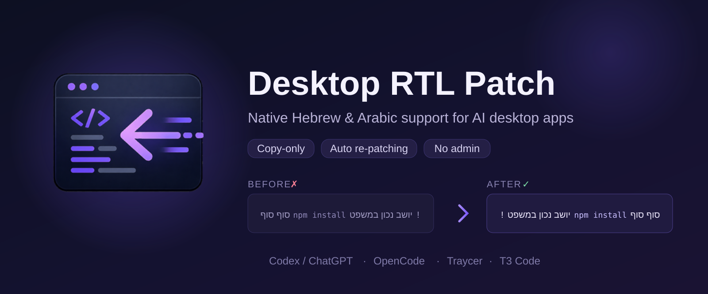
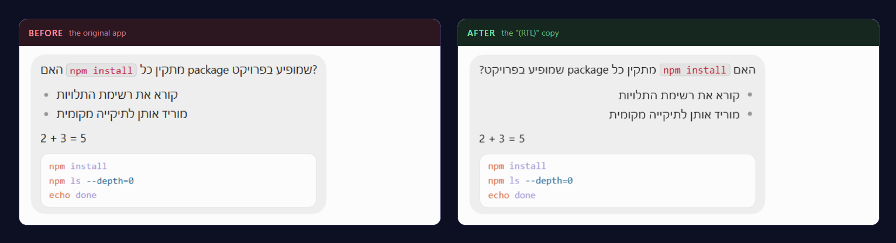
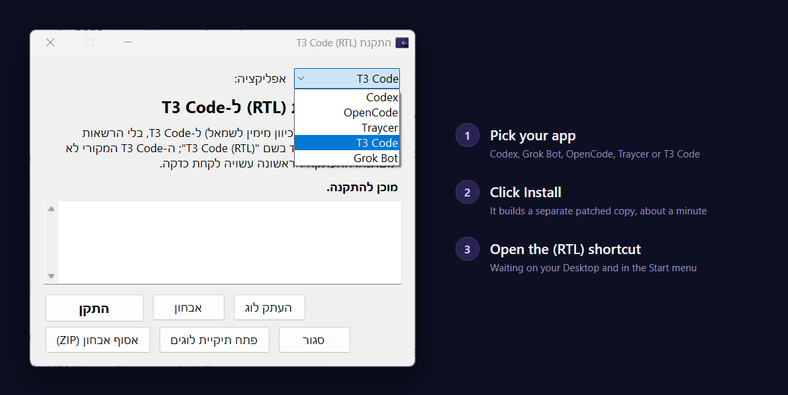

<p align="center">
  
</p>

<h1 align="center">Desktop RTL Patch</h1>

<p align="center">
  <b>Hebrew &amp; Arabic RTL support for AI desktop apps on Windows.</b><br>
  Fixes right-to-left text without modifying the original apps.
</p>

<p align="center">
  <a href="https://github.com/ElazarKrispel/desktop-rtl-patch/releases/latest"></a>
  
  <a href="LICENSE"></a>
</p>

<p align="center">
  <a href="https://github.com/ElazarKrispel/desktop-rtl-patch/releases/download/v2.4.0/desktop-rtl-patch-2.4.0.zip"></a>
</p>

<p align="center">
  <sub>Windows 10/11 &nbsp;&middot;&nbsp; 285 KB &nbsp;&middot;&nbsp; SHA-256 published &nbsp;&middot;&nbsp;
  <a href="https://github.com/ElazarKrispel/desktop-rtl-patch/releases">All releases</a></sub>
</p>

## Before and after

These apps render every chat message left-to-right, which makes Hebrew and Arabic look broken:
the sentence is aligned to the wrong side, the final punctuation jumps to the wrong end, and an
English word or an inline `` `token` `` lands in the wrong place. The patch makes prose flow
right-to-left while code stays strictly left-to-right.

<p align="center">
  
</p>

<p align="center"><sub>The very same reply, in the original app and in its patched copy. Only the
direction changes: the code block stays left-to-right in both.</sub></p>

## Works with

**ChatGPT / Codex** &nbsp;&middot;&nbsp; **Grok Bot** &nbsp;&middot;&nbsp; **OpenCode** &nbsp;&middot;&nbsp; **Traycer** &nbsp;&middot;&nbsp; **T3 Code** &nbsp;&middot;&nbsp; **Herdr**

Each app gets its own patched copy and its own "(RTL)" shortcut, and you can install as many of
them as you like. Names are used only to say what this patches; see the
[disclaimer](#disclaimer).

## Safe by design

* **Your original install is never modified.** The patch builds a separate copy, and a `[SAFETY]`
  guard refuses to write anywhere outside the tool's own staging and copy folders.
* **No administrator rights.** Everything runs under your own user account.
* **No external Node.js.** The apps that need a Node runtime use the one they already ship;
  Traycer and T3 Code need none at all.
* **It keeps up with app updates.** A background agent rebuilds the copy after the real app
  updates, and swaps it in only while the copy is closed.
* **MIT licensed**, and the whole RTL fix is one readable file: [`src/desktop-rtl-patch.js`](src/desktop-rtl-patch.js).

## Install

1. **[Download the ZIP](https://github.com/ElazarKrispel/desktop-rtl-patch/releases/download/v2.4.0/desktop-rtl-patch-2.4.0.zip)**
   and extract it (right-click the file, "Extract All").
2. Double-click **`Install-Desktop-RTL.vbs`**. A small window opens.
3. Pick your app at the top, click **התקן** (Install), and wait about a minute.
4. Open the new **"... (RTL)"** shortcut from your Desktop or Start menu. That is the patched copy.

<p align="center">
  
</p>

**Requirements:** Windows 10 or 11 (Windows PowerShell 5.1 is built in), and at least one
supported app already installed. The installer window is in Hebrew.

### התקנה מהירה (עברית) 🚀

<div dir="rtl">

1. ודאו שהאפליקציה שרוצים לתקן מותקנת: **Codex** מה-Microsoft Store (בגרסאות החדשות היא כבר
   נקראת **ChatGPT**), **Grok Bot**, **OpenCode**, **Traycer** או **T3 Code**.
2. **[⬇️ לחצו כאן להורדת הקובץ (ZIP)](https://github.com/ElazarKrispel/desktop-rtl-patch/releases/download/v2.4.0/desktop-rtl-patch-2.4.0.zip)**,
   ומחלצים אותו (לחיצה ימנית על הקובץ ← "Extract All").
3. דאבל-קליק על **`Install-Desktop-RTL.vbs`**. נפתח חלון התקנה בעברית. בוחרים את האפליקציה
   בבורר שלמעלה, לוחצים **"התקן"** וממתינים כדקה.
4. פותחים את קיצור הדרך החדש עם ה-**(RTL)** משולחן העבודה או מתפריט Start. זהו! 🎉

> בלי הרשאות מנהל ובלי להתקין Node.js. ההעתקה הראשונה לוקחת כדקה, ומכאן זה מתעדכן לבד.
> תמיד פותחים דרך קיצור הדרך עם ה-(RTL); האפליקציה המקורית נשארת LTR ולא משתנה.
> אפשר להתקין לכמה אפליקציות במקביל, וכל אחת מנוהלת בנפרד.

</div>

## Using it

* **Always launch the app from its "(RTL)" shortcut.** That is the patched copy.
* The plain app keeps working too, but it stays left-to-right (unpatched).
* The copy and the original share the same account and conversations, so you see the same threads
  either way.
* Don't run the copy and the original at the same time (they share data); just use the "(RTL)" one.

## Automatic updates

The apps update themselves, so a patched copy would otherwise fall behind. A small **background
agent** keeps every installed app in sync:

* It starts at logon from your own `HKCU\...\Run` key (**no admin**) and re-checks periodically.
* When the original app updates, it rebuilds the patched copy in a **staging** folder and swaps it
  in **only while the "(RTL)" copy is closed** (an atomic rename). It never restarts or breaks a
  running app; if you are using it, the swap waits until you next close it.
* The agent puts one **system-tray icon** in the notification area, shared by every installed app.
  From there you can open, update, configure or run diagnostics for each app, toggle automatic
  updating, and install tool updates.
* You can also force an update from the installer window (**"התקן מחדש"**), or run
  `Update-DesktopRtl.ps1` (see [Advanced](#advanced)).

## Settings

The tray menu's **"הגדרות..."** opens a per-app settings dialog. Everything in it is optional and the
defaults suit most people.

| Setting | What it does |
|---|---|
| **Enable / disable** | Turns the RTL patch off for one app without uninstalling it. |
| **Direction policy** | `anyHebrew` (default): a line is RTL if its non-code text contains **any** Hebrew or Arabic, so a Hebrew sentence stays right-to-left even when it opens with `` `code` `` or an English word. `firstStrong`: decide from the first strong character in the line. Pure-English lines stay LTR either way. |
| **Surfaces** | Toggle each surface on its own: prose (paragraphs, headings, lists), input fields, tables, math isolation, and code isolation. |
| **Math isolation** | Wraps LaTeX (`$...$`, `\(...\)`, `\[...\]`) and bare arithmetic in isolated LTR spans, so `2 + 3 = 5` never renders mirrored inside a Hebrew paragraph. |
| **Tables** | Flips whole-column order for Hebrew tables, decided by the majority direction of the header or first column. |
| **Font** | Optionally restyle the flipped prose only, with your own font family and a size between 80% and 150%. |

Changes apply the next time you open that app.

## Uninstall

* In the installer window, pick the app and click **"הסר התקנה"** (Remove).
* Or run `Uninstall-DesktopRtl.ps1` (see [Advanced](#advanced)).

It removes that app's patched copy, shortcuts, watcher and state; the other apps are untouched.
The log folder is kept for diagnostics (add `-PurgeLogs` to delete it too). The original apps are
unaffected.

## Advanced

<details>
<summary>One-line install from PowerShell</summary>

For technical users who prefer the terminal, open **PowerShell** and paste a single line:

```powershell
irm https://raw.githubusercontent.com/ElazarKrispel/desktop-rtl-patch/v2.4.0/install.ps1 | iex
```

This downloads the same code, pinned to the `v2.4.0` tag and verified against the published
SHA-256 checksum, then opens the installer window. Running a remote script means trusting it; if
you are unsure, prefer the ZIP download above (it is exactly the same code, and you can read it
first).

Prefer no window at all? Add `RTL_SILENT` (and optionally `RTL_APP`) on the same line and the
whole install runs headless in the terminal:

```powershell
$env:RTL_SILENT='1'; irm https://raw.githubusercontent.com/ElazarKrispel/desktop-rtl-patch/v2.4.0/install.ps1 | iex
$env:RTL_SILENT='1'; $env:RTL_APP='grokbot'; irm https://raw.githubusercontent.com/ElazarKrispel/desktop-rtl-patch/v2.4.0/install.ps1 | iex
```

</details>

<details>
<summary>Headless CLI</summary>

All of these take `-App codex|opencode|traycer|t3code|grokbot` (default `codex`):

```powershell
powershell -ExecutionPolicy Bypass -File .\scripts\Install-DesktopRtl.ps1 -App grokbot
powershell -ExecutionPolicy Bypass -File .\scripts\Update-DesktopRtl.ps1 -App grokbot
powershell -ExecutionPolicy Bypass -File .\scripts\Uninstall-DesktopRtl.ps1 -App grokbot
```

</details>

<details>
<summary>Verifying the download</summary>

Every release publishes a `SHA256SUMS.txt` next to the ZIP, and the one-line installer checks it
automatically before extracting. To check the ZIP by hand:

```powershell
Get-FileHash .\desktop-rtl-patch-2.4.0.zip -Algorithm SHA256 | Select-Object -ExpandProperty Hash
```

Compare the result with the line in `SHA256SUMS.txt` on the
[release page](https://github.com/ElazarKrispel/desktop-rtl-patch/releases/latest).

</details>

## How it works

* **[`src/desktop-rtl-patch.js`](src/desktop-rtl-patch.js)** runs in the renderer, and the same
  file serves every supported app. For each prose block whose non-code text contains Hebrew or
  Arabic it sets a real **`dir="rtl"`** attribute, which gives correct ordering, `text-align: start`
  alignment and native bidi isolation in one step. Injected CSS forces every code surface to
  `direction: ltr` plus `unicode-bidi: isolate`. A `MutationObserver` re-applies `dir` to streamed
  or late content and survives framework re-renders.
* **[`scripts/Install-DesktopRtlGui.ps1`](scripts/Install-DesktopRtlGui.ps1)** is the graphical
  installer (WinForms, Hebrew) with the app selector. It wraps the shared library, shows progress,
  and offers install / update / open / uninstall per app.
* **[`scripts/lib/desktop-rtl-lib.ps1`](scripts/lib/desktop-rtl-lib.ps1)** holds per-app
  **profiles** (install location, layout, Node strategy, watcher identity) and the engine: resolve
  the original install, build the patched copy with staging plus an atomic swap, inject, verify,
  and manage the agent. It **only reads** the originals and edits **separate copies** (a `[SAFETY]`
  guard enforces this).
* **[`scripts/lib/asar-edit.mjs`](scripts/lib/asar-edit.mjs)** surgically injects the script into
  `app.asar`: it appends to the data section and rewrites the header, with no full repack, then
  verifies the result.
* **[`scripts/lib/desktop-rtl-herdr.ps1`](scripts/lib/desktop-rtl-herdr.ps1)** handles the one
  target that is not an Electron app. Herdr is a native Rust terminal program with no renderer to
  inject, so its RTL fix is compiled into the binary and this file installs that build beside the
  official one, with its own private settings, session and sockets.

## Per-app notes

<details>
<summary><b>ChatGPT / Codex</b> - Microsoft Store (MSIX)</summary>

* The patch uses the **Node runtime bundled inside the app** (`cua_node`), so nothing extra is
  installed. The copy's `app.asar` is the only edited file.
* The 2026 builds replaced the app runtime, renamed the main executable to `ChatGPT.exe`, moved
  the renderer, and added a strict Content-Security-Policy. The patcher detects all of that
  automatically; the injected script is loaded as a same-origin file, which the CSP allows.
* The original Store package (under `WindowsApps`) is read-only and is only ever **read**.
* Patched copy: `%LOCALAPPDATA%\OpenAI\CodexRtl`.

</details>

<details>
<summary><b>Grok Bot</b> (xAI) - per-user installer</summary>

* The executable sits at the tree root and the renderer really is served from inside
  `resources\app.asar` (`dist/renderer/index.html` loading `./assets/index-*.js`), so the copy's
  `app.asar` is the single edited file. Its asar-integrity fuse ships **disabled**.
* **No bundled Node**: the editor runs the copy's own Electron binary as Node
  (`ELECTRON_RUN_AS_NODE` plus `ELECTRON_NO_ASAR`).
* Its Content-Security-Policy is `script-src 'self'` and `style-src 'self' 'unsafe-inline'`, which
  allows both the injected same-origin script and the style element the RTL payload creates.
* **Its self-updater is switched off in the RTL copy only.** Grok Bot ships its own updater, which
  would otherwise replace the patched `app.asar` behind the tool's back. Grok Bot's own kill
  switch, the `SAND_DISABLE_UPDATES=1` environment variable, is therefore set on every launch of
  the copy, by the generated `Launch-GrokBotRtl.vbs` behind the "(RTL)" shortcut and by the
  tray/installer "open" action. **Your original Grok Bot keeps updating exactly as before**; the
  copy picks each new version up from the original through the agent, as every other app does.
* Grok Bot shares a single-instance lock with its original. If the original is open, launching the
  RTL copy focuses the original instead, so open only one of the two.
* Patched copy: `%LOCALAPPDATA%\RtlPatch\grokbot`.

</details>

<details>
<summary><b>OpenCode</b> (anomalyco / SST) - per-user installer</summary>

* **No bundled Node**: the editor runs the copy's own Electron binary as Node via
  `ELECTRON_RUN_AS_NODE` (with `ELECTRON_NO_ASAR`, so `fs` reads `app.asar` as a plain file).
  The copy's `app.asar` is the only edited file.
* The copy drops `resources\app-update.yml` so its updater never overwrites the patch; updates
  flow only through the original plus the agent.
* Patched copy: `%LOCALAPPDATA%\RtlPatch\opencode`.

</details>

<details>
<summary><b>Traycer</b> (traycer.ai) - per-user installer, nothing binary is touched</summary>

* Shaped like OpenCode (executable at the tree root, `app-update.yml` dropped from the copy), but
  with one key difference: Traycer does **not** serve its renderer from inside `app.asar`. Its main
  process registers a custom `app://` protocol and serves the UI from the **loose** directory
  `resources\renderer\` (`index.html` plus `assets\`).
* So the patch simply edits that loose `index.html` in the copy and drops the RTL script into its
  `assets\`: **no `app.asar` edit and no executable edit at all**. The copy's `app.asar` and
  `Traycer.exe` stay **byte-identical** to the original, so Traycer's asar-integrity setting is
  irrelevant and no Node is needed.
* Patched copy: `%LOCALAPPDATA%\RtlPatch\traycer`.

</details>

<details>
<summary><b>T3 Code</b> (t3.chat) - per-user installer, no Node needed</summary>

* The renderer is header-listed under `app.asar.unpacked`, so new adjacent asset files are not
  visible through Electron's asar path. The config and payload are therefore embedded inline,
  exactly once, in the copy's renderer `index.html`. Neither `app.asar` nor the executable is
  edited, and no Node runtime is needed.
* The supported layout is the v0.0.33-era loose renderer. Builds containing `resources\server.asar`
  use a newer layout and fail clearly without changing anything.
* T3 Code shares a single-instance lock with its original. If the original is open, launching the
  RTL copy may focus the original. Launching either copy may also become the current `t3code://`
  protocol handler. WSL-only mode and `VITE_DEV_SERVER_URL` are not supported.
* Patched copy: `%LOCALAPPDATA%\RtlPatch\t3code`.

</details>

<details>
<summary><b>Herdr</b> - terminal workspace manager (native binary, not Electron)</summary>

Herdr is a Rust terminal program, not an Electron app, so there is no HTML renderer to patch. Its
RTL support is a display-only pass inside Herdr itself: the composed frame is reordered into visual
order just before it is painted, because Windows Terminal and the classic console run no
bidirectional algorithm of their own and print cells in the order they receive them.

* The fix lives in a fork, [ElazarKrispel/herdr](https://github.com/ElazarKrispel/herdr), and this
  tool installs that prebuilt binary as **Herdr (RTL)**. Your official Herdr install is only read,
  never modified or replaced.
* The RTL build keeps its own `config.toml`, `session.json`, sockets and logs under
  `%LOCALAPPDATA%\RtlPatch\herdr`, so the two can run side by side and the official Herdr's state
  is untouched. On first install your official settings are copied across.
* Everything except the pixels stays in logical order: scrollback, selection and copy,
  `herdr pane read`, and agent detection are unaffected, and mouse positions are mapped back before
  they reach the program in the pane.
* Hebrew is fully fixed. Arabic and Persian get the correct order but keep isolated letter forms,
  because the host terminals do not shape them either.

</details>

<details>
<summary><b>All supported apps</b> - and how this differs from other RTL patches</summary>

**The original install is never modified.** Only a separate copy is ever written, guarded by a
`[SAFETY]` check that refuses to touch anything outside the tool's own staging and copy folders.
For ChatGPT/Codex, Grok Bot and OpenCode the copy's `app.asar` is the only edited file (their
asar-integrity fuse ships disabled); for Traycer and T3 Code only renderer HTML in the copy is
edited; for Herdr nothing is edited at all, because a separately built binary is installed
alongside. Other RTL patches flip a fuse on the **original signed binary** and patch the install in
place; this tool never touches the original.

</details>

## FAQ and troubleshooting

<details>
<summary>Common questions</summary>

* **Does the regular app now show RTL too?** No, only the "(RTL)" copy. The original is
  intentionally left untouched (LTR).
* **My Codex updated and is now called ChatGPT; Hebrew broke.** Update this tool to v2.0.0 or
  later and click **"התקן מחדש"** (Reinstall); the new layout is supported.
* **Will I lose my chats or need to log in again?** No. The copy and the original share the same
  account and conversations; the "(RTL)" app is just a patched copy of the same app.
* **Do I need to install Node.js?** No. The profiles that need Node use an app-provided runtime;
  Traycer and T3 Code do not need Node at all.
* **A PowerShell window flashes when I use the `.cmd`.** That is just the launcher closing. Use
  `Install-Desktop-RTL.vbs` for no window at all.
* **"... (RTL) is running."** Close it first (check the system tray), then try again.
* **Something failed.** In the installer window, click **"העתק לוג"** (Copy log) or
  **"פתח תיקיית לוגים"** and send the log file; it has the technical details.
  **"אסוף אבחון (ZIP)"** packs a sanitized diagnostics bundle.
* **Did it work?** Launch the "(RTL)" copy and type a Hebrew sentence with an English
  `` `token` `` in backticks. It should read right-to-left with the code in place.

</details>

<details>
<summary>Repository layout</summary>

```
Install-Desktop-RTL.vbs            double-click launcher (no console window)
Install-Desktop-RTL.cmd            alternative launcher (delegates to the .vbs)
Desktop-RTL-Tray.vbs               tray launcher (no console window)
Desktop-RTL-Settings.vbs           settings launcher (no console window)
install.ps1                        advanced one-line web bootstrap (pinned to a tag)
src/desktop-rtl-patch.js           injected renderer script (the RTL fix, configurable)
scripts/Install-DesktopRtlGui.ps1  graphical installer (WinForms, Hebrew, app selector)
scripts/DesktopRtlTray.ps1         system-tray agent (auto-update plus menu, all apps)
scripts/DesktopRtlSettings.ps1     settings dialog (WinForms, Hebrew): direction, surfaces, font
scripts/Install-DesktopRtl.ps1     headless installer, -App codex|opencode|traycer|t3code|grokbot
scripts/Update-DesktopRtl.ps1      force a re-patch, same -App switch
scripts/Uninstall-DesktopRtl.ps1   remove the copy, shortcuts, tray/watcher, state
scripts/Watch-DesktopRtl.ps1       background watcher (event-driven auto-update, no admin)
scripts/Build-Release.ps1          package a checksummed release asset (maintainer helper)
scripts/lib/desktop-rtl-lib.ps1    shared logic: profiles, resolve, staging+swap, verify, agent
scripts/lib/asar-edit.mjs          surgical, dependency-free asar editor plus verifier (Node)
test/bidi-harness.html             visual bidi test cases
test/renderer-injection.harness.ps1  renderer injection regression harness
tools/                             maintainer artwork tooling (not shipped in the release)
```

</details>

## Disclaimer

Unofficial community project, not affiliated with or endorsed by OpenAI, xAI, OpenCode's makers,
Traycer, or T3 Code. It was built for accessibility: Hebrew and Arabic right-to-left support,
which these apps do not yet provide. It modifies **local copies** of the apps and does **not**
redistribute any of their code; it does not bypass authentication, payment, or access controls,
and it never changes the original installs. Modifying an app may not be permitted by its terms of
service, so please review them and use this at your own discretion and risk. "ChatGPT", "Codex",
"Grok Bot", "OpenCode", "Traycer" and "T3 Code" are trademarks of their respective owners; this is
an independent project that only describes its own patch.
