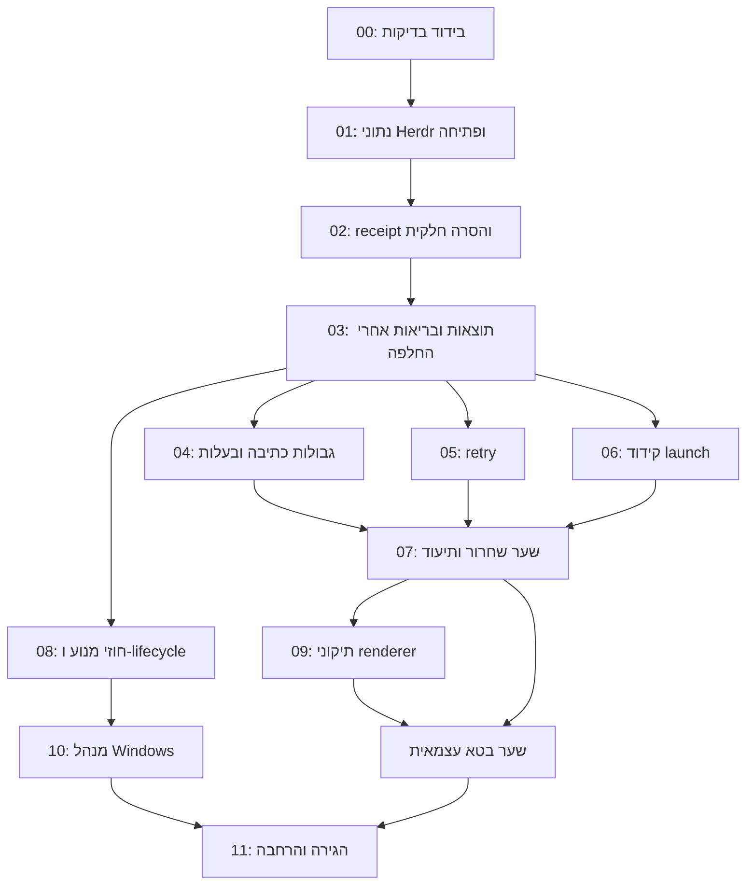

# תכנית PRים וחבילת ביצוע ראשונה

זו הצעת מימוש לאישור. אין במסמך הרשאה לשינוי מוצר, להרצת מתקין במחשב העבודה או לפרסום. כל PR יופק מול HEAD שייבדק מחדש, עם בדיקה שנכשלה לפני התיקון ועוברת אחריו. אין צורך למזג את PR #8 כדי להתחיל ענף תיקון מה־main הרלוונטי.

## סדר ותלויות

הגרף מציג סדר אינטגרציה מומלץ. fixtures ל־renderer, חקר מדיניות נתיבים וניסוח תיעוד יכולים להתקדם קודם; אין תלות טכנית של renderer בהשלמת PR-07. בעלות אחת על lib/state/results תמנע שינויים סותרים. בטא ראשונית יכולה להשתמש בממשק הנוכחי אחרי שעברו שערי האמינות; GUI חדש אינו תנאי לגל ניסוי קטן. בדיקת N04 מבודדת ובדיקת child environment נכללות בשער PR-07 לפני בטא. ריפקטור AppContext הרחב ב־PR-08 אינו תנאי מוקדם להוכחת התיקונים האלה.

## PR-00: בדיקות בטוחות שאפשר להריץ שוב

**עדיפות ותלות:** ראשון, ללא תלות בקוד מוצר. זהו בסיס קטן לחבילת ההקשחה, לא דחייה של התיקונים עד למערכת CI גדולה.

**Scope וקבצים:** fixtures חדשים תחת test, פקודת בדיקה מקומית מתועדת ותיקון בידוד ב־test/renderer-injection.harness.ps1. הפרדת בדיקות טהורות מ־Windows integration. הסקריפט הישן מסיט קיצורים ומשתמש באירוע quit ייחודי, אבל קריאות uninstall עדיין מגיעות ל־Registry/ownership/process APIs דרך פונקציות המוצר. לא להריץ אותו אוטומטית על מחשב המפתח בלי סגירת הגבולות. אין שינוי התנהגות התקנות.

**קבלה ובדיקות:** אין כתיבה מחוץ ל־root ייחודי, אין פנייה ל־HKCU האמיתי, תהליכים ואירועים של מוצר חסומים. Windows PS5.1 parse/BOM/ASCII ו־Node checks אינם מדולגים אם חסרה תלות. הרצת suite אינה מסתפקת באסרטים של lock release, אלא כוללת partial עם exe שנמחק. הראיות שבחבילה הנוכחית הן מקור למקרים, לא להעתקת mocks שמבטיחים את התוצאה מראש.

**נסיגה:** להסיר את runner החדש ולהשאיר את ה־fixtures והתיעוד לבדיקה ידנית מבודדת. לא להשיב ריצה לא מבודדת ל־CI.

## PR-01: שמירת נתוני Herdr ופתיחה עקבית

**ממצאים:** F03 ו־N05. תלוי PR-00. ראשון מבין תיקוני המוצר.

**Scope וקבצים:** desktop-rtl-lib.ps1, desktop-rtl-herdr.ps1, Uninstall-DesktopRtl.ps1, טקסט ההסרה ב־Install-DesktopRtlGui.ps1 וה־callers של Open במגש/הגדרות. default uninstall שומר data/state בעלי ערך; artifact.work ניתן לניקוי תחת בעלות. PurgeLogs מוחק לוגים בלבד. כל מסלולי Open משתמשים באותו launch plan של adapter, עם XDG ו־terminal host מתאימים. שומרים seed-on-first-install ואת תיקוני CMD הקיימים.

**מחוץ ל־scope:** checkbox חדש למחיקת פרופיל, purge נתונים מכל סוג, fork חדש, GUI חדש, שינוי כל profiles או מעבר שפה. פרופיל משותף/לא ידוע נשמר תמיד.

**קבלה:** hash של config/session נשמר אחרי uninstall רגיל, PurgeLogs ו־reinstall כאשר הגדרת bidi אינה משתנה. אם הגדרת bidi משתנה, הדלתא היחידה ב־config היא המפתח המנוהל; יתר TOML וה־session נשארים byte-identical. recorder בטוח ל־argv/env/cwd מוכיח זהות בין shortcut, GUI, tray ו־settings; התהליך הראשי אינו משנה XDG של פעולות אחרות. כשל launch מוצג ככשל. טקסט האשף מציין שיתוף/פרטיות במדויק. E2E Herdr רק ב־VM או פרופיל בדיקה מאושר.

**נסיגה:** השבתת Open/התקנת Herdr חדשה אם נכשלה בדיקת הבידוד, תוך השארת מידע וקיצור תקין מוכר. אין rollback שמחזיר מחיקת data או גרסה ישנה המתעלמת ממדיניות שמירה. לא למחוק נתונים שנשמרו בעת נסיגה.

## PR-02: הסרה חלקית נשארת ניתנת להשלמה

**ממצאים:** F02, בסיס F08 ו־N03, תוצאות Partial קיימות ב־F04. תלוי PR-01/00.

**Scope וקבצים:** lib:uninstall/enumeration/status/state, GUI frame/actions, Tray reconcile/menu, CLI uninstall ו־fixtures. receipt מינימלי עם schemaVersion, installationId, appId, uninstallIntent, phase, owned-artifact identifiers, leftovers ו־lastOperation. helper אטומי משותף לכתיבה שנדרשת כאן; קריאת status אינה עושה quarantine. discovery מבדיל managed installation, missing executable, cleanup pending ו־retained user data. הנתונים שנשמרו אחרי הסרה מוצלחת אינם 'אפליקציה מותקנת' המפעילה autopatch.

**קבלה:** non-exe נעול, exe נמחק, source חסר, restart, UI מציג Complete removal; unlock והשלמה דרך אותו ממשק. אותו רצף גם לאפליקציה אחרונה וגם כשאחרות נשארות. agent נשמר כאשר cleanup pending; auto-update אינו מתקין מחדש נגד uninstallIntent. receipt פגום/ישן אינו נותן הרשאת מחיקה לנתיב זר. interruption בכתיבה משאיר רשומה קודמת תקינה או recovery ידוע. אין rename ל־.bad מתוך status. CLI/GUI Partial הקיים נשמר ואינו מוצג כיכולת חדשה.

**נסיגה:** receipt חדש נשמר. אפשרות reader ישן רק עם version guard וכיבוי פעולות הרסניות שאינן מבינות CleanupPending; לא למחוק receipt כדי שגרסה קודמת תעבוד. ייצוא/גיבוי לפני מיגרציה ושחזור metadata בלבד, ללא שחזור מחיקת מידע משתמש.

## PR-03: תוצאות סופיות ואימות העותק הפעיל

**ממצאים:** F04 ו־N02, חשיפת N03. תלוי PR-02.

**Scope וקבצים:** update ו־Enter-RtlLock בליבה, Invoke-AtomicSwap/ReseedStaging ושמירת העותק הקודם עד commit סופי, Herdr install, install/update/watch/uninstall CLI, GUI worker, DesktopRtlSettings.ps1, Tray worker ו־Start-AppUninstall. מעטפת תוצאה גרסאית פנימית, עם Succeeded, AlreadyCurrent, Deferred, Busy, Blocked, Partial, Failed, reason ו־prepared flag. אין צורך לפרסם כבר פרוטוקול IPC כללי של המנהל העתידי. output אנושי נשמר בנפרד מנתוני התוצאה. worker מוסתר מספק completion עמיד לפי operationId; UI יודע לזהות תהליך שמת ללא תוצאה.

**קבלה:** lock contention אמיתי -> Busy; AccessDenied/כשל יצירת lock -> Failed ולא Busy. כל consumer מציג אותה משמעות. Deferred של Herdr אינו 'מוכן', staging של Electron מזוהה בנפרד. כשל post-swap בכל renderer mode אינו רושם בריאות תקינה או UpToDate, ונבדק שוב או מופעל rollback מוגדר. העותק הקודם נשמר עד verification סופי; אין לסמן את rename בלבד כסיום מוצלח. worker שנכשל/נסגר מציג תוצאה גם אחרי פתיחת מנהל מחדש; Partial משאיר PR-02 recoverable. בדיקה מפרידה validation failure מדחייה עקב אפליקציה פתוחה.

**נסיגה:** consumer compatibility לשדות לא מוכרים, שמירת last result ו־receipt, עצירת auto-update אם אי אפשר לפרש בריאות. שחזור העותק הקודם רק אם הוא עדיין קיים ואומת לפי הגרסה שלו. אין rollback שמסמן אימות שנכשל כהצלחה. אין הנחה שסוכן ישן מבין schema חדש.

## PR-04: גבולות כתיבה ומחיקה לפי בעלות

**ממצאים:** F01 ו־N01. סגירת מודל האמון לפני המימוש; אינטגרציה אחרי PR-03 כדי ש־Blocked/Partial ידווחו נכון. חקר fixtures יכול להתחיל מוקדם.

**Scope וקבצים:** guards, mirror/staging/swap/config/uninstall/shell cleanup בליבה וב־Herdr; asar-edit.mjs fuseoff; helper Windows קטן אם דרוש להגנה דרך handle. מפת כל mutation והפרדה בין source לקריאה, writable artifacts, profile data ו־shell entries. receipt אינו מקור סמכות לנתיב שרירותי. CLSID/verb נמחקים ברמת values/subkeys שבעלותם הוכחה; אב רק כשהוא ריק ואין בו ערכים זרים. שגיאת discovery/הרשאות נכנסת ל־Partial/Unknown ולא הצלחה שקטה.

**קבלה:** direct/prefix/junction/root-link/file-link/hard-link ומעבר root בין check/open; יעד חיצוני byte-identical. בקרה פנימית תקינה ממשיכה לעבוד. לבדוק כל אסטרטגיית write ולא להסיק מתוצאת fuseoff על atomic replace. Registry פרטי מכיל command בבעלות לצד sibling זר והוא נשמר; source/prefix/environment/quoting נבדקים. source symlink של Herdr מותר לקריאה בתנאים המוצהרים. קישור אסור אינו גורר ניסיון חוזר בלתי מוגבל.

**נסיגה:** adapter/פעולה שאינה עומדת במדיניות נשארים חסומים עם recovery ברור. אין להחזיר guard לקסיקלי ולקרוא לזה rollback בטוח. ספריית helper נשארת צרה ומבודדת; אין מעבר מנוע מלא ל־C# במסגרת PR זה.

## PR-05: retry שמתאושש מכשל זמני

**ממצאים:** F05. תלוי בתוצאת PR-03, ובשדות הכתיבה האטומית ב־PR-02.

**Scope וקבצים:** Herdr artifact resolver, classification/latch, tray/watch scheduling ו־error strings. Network/Timeout/RateLimit נפרדים מ־integrity/layout/unsupported; nextAttemptAt ותקציב ניסיונות. לא מוסיפים הורדות או אפליקציות.

**קבלה:** HTTP fixture אמיתי נכשל פעמיים ואז מגיש חבילה תקינה, והמנוע מתאושש ללא Force. 429 מכבד מועד ניסיון; אין העתקה/בלון בכל poll. checksum שגוי לעולם אינו מתקדם להתקנה; כשל מבני חוזר נשאר חסום. signature/patchVersion invalidation וכללי Force הקיימים נשמרים. שעון מוזרק כדי לבדוק backoff ללא המתנות ארוכות.

**נסיגה:** כיבוי auto retry לאותו adapter ושמירת ניסיון ידני עם בדיקת integrity. לא לבטל latch גלובלית. שדות schema חדשים נסבלים על ידי reader הישן או נחסמים במפורש.

## PR-06: קיצור Grok בנתיב Unicode

**ממצאים:** F06. יכול להתפתח בנפרד מ־PR-05; תיאום בעלות על lib.

**Scope וקבצים:** New-RtlLaunchScript/New-RtlShortcut והבדיקות, רק encoding ו־quoting הנחוצים. Herdr CMD שכבר UTF-8 אינו משוכתב. UI חדש ו־binary launcher חדש אינם תנאי לתיקון הקצר.

**קבלה:** WSH מפעיל recorder ולא אפליקציה אמיתית, תחת נתיב עברי עם רווחים. argv/env/cwd נכונים, SAND_DISABLE_UPDATES=1 ו־Electron flags הוסרו לילד. בדיקת shortcut בפרופיל בדיקה ו־redirected folder. bytes-only אינו מספיק לסגירה. Open מה־GUI נשאר עקבי למרות שהוא לא עובר דרך VBS.

**נסיגה:** שמירת מסלול Open עובד עם הודעת שגיאה ברורה לקיצור; לא החזרת VBS משחית נתיבים. הסרת launcher חדש אינה מוחקת copy/profile. מיגרציית shortcut תומכת בעותק גיבוי ובהחלפה מבוקרת.

## PR-07: חבילה מזוהה, הורדה מאומתת ושער שחרור

**ממצאים:** F07/F10. תיעוד יכול להתחיל קודם; מועמד בטא דורש השלמת PR-01..06 ובדיקות renderer הנדרשות.

**Scope וקבצים:** Build-Release.ps1, install.ps1, Test-RtlPackage/Copy-RtlBin/Test-RtlStagedBin, update decision/self-update, Herdr checksum, workflow Windows חדש, README, compatibility matrix, CHANGELOG, SECURITY/CONTRIBUTING ודיווח תקלה. Runtime manifest אחד מחייב. exact asset name/version/architecture, שורת checksum קשורה לשם, דחיית כפילות/ambiguity. fallback ללא אימות נסגר גם ב־timeout. בנייה מאותו SHA וחבילת הבדיקה היא מועמדת ההפצה.

**קבלה:** missing required file נכשל לפני ZIP; wrong name/digest/duplicate/missing sums/partial download/timeout אינם מתקינים. Herdr local developer override מופרד מפעולת משתמש רגילה. archive כולל רק רשימה מותרת, אין raw profiles/credentials. checksums מדווחים בנפרד מחתימות. CI עם בדיקות מחייבות וללא skip שקט של Node. package install/update/uninstall/reinstall ו־agent readiness recovery ב־VM. N04 נבדק ב־host מבודד בזמן worker פעיל; כשל שמשוחזר חוסם את השער ומקבל תיקון ממוקד, ללא הנחה שנדרש שכתוב. בידוד child environment נבדק עם פעולות חופפות ומועבר מוקדם מ־PR-08 במידת הצורך. בדיקת pipeline חוזר אינה מכונה byte reproducible עד שהשוויון נמדד.

**נסיגה:** להשאיר את הגרסה המותקנת, לפרסם בהמשך רק artifact מאומת שאושר, ולהחזיר downloader למצב כשל ברור. לא לעקוף checksum כדי להתגבר על תקלה. חתימות, מפתחות, הגדרות repository ופרסום הם שער אישור נפרד; אין release אוטומטי ב־PR.

## PR-08: הפרדה הדרגתית של חוזי המנוע והסוכן

**ממצאים:** המשך F08 וחקירת N04. תלוי receipt/results יציבים, אינו תנאי לכל תיקון renderer קטן.

**Scope וקבצים:** AppContext ו־LaunchPlan, repository/state access, ProcessRunner ו־agent coordinator; מימוש PowerShell תחילה או החלפת helper מוגדר אחד. `Set-RtlActiveApp` נשאר shim זמני. JSON-lines protocol גרסאי ל־worker נפרד, stdout לאירועים ותוצאה, stderr ללוגים; request קבוע עם appId ולא shell חופשי. child environment מפורש בלי mutation כלל־תהליכי. הרחבת atomic write ל־config/block אחרי הבסיס ב־PR-02.

**קבלה:** שתי פעולות באפליקציות שונות אינן מחליפות נתיבים/סביבה. status טהור. crash writer/worker, downgrade schema, backup פגום ו־migration idempotence. VM עם tray חלופי ושמות mutex/event ייחודיים בודק quit באמצע staging, uninstall של אפליקציה אחרת, self-update/readiness ו־restart. cancellation מתקבל בנקודות מוגדרות, לא באמצע swap. לא טוענים לסגירת N04 על בדיקת Set/Dispose בלבד.

**נסיגה:** תאימות shim והחזרת adapter אחד למימוש הקודם עם אותם results/receipt; לא מחיקת schema או runtime IDs קיימים. ownership על agent home נשאר יחיד. אין הבטחת rollback של תהליך שהרגו באמצע כתיבה ללא journal.

## PR-09: RTL עקבי בזמן streaming ו־DOM reuse

**ממצאים:** F09. תיקוני הליבה נדרשים לפני בטא עצמאית, ואפשר לקדמם ללא תלות בשכתוב המנוע.

**Scope וקבצים:** desktop-rtl-patch.js, בדיקות דפדפן שטוענות אותו באמת, חיבור ל־CI וטקסט עזרה להגדרות אם נדרש. gating של leaf/prose, שימור ownership של dir, dirty table scheduling וחישוב מחודש, מדיניות raw-math rewriting. `math=false` הקיים נשמר. אין שינוי ל־logical text, אין היפוך Unicode ואין פורט של אלגוריתם ה־renderer לשפה אחרת.

**קבלה:** חמשת מקרי השחזור מתוקנים, שתי הבקרות וכל toggles עוברים. absent/ltr/rtl/auto ו־dir שהאפליקציה משנה נבדקים. טבלת אב מתעדכנת גם על characterData של תא, בלי replace של table. framework streaming/selection/undo/paste/IME/clipboard וקוד מועתק במדויק; בדיקות חיות בגרסאות הבטא המאושרות נרשמות בנפרד. לא מכנים היעדר exception תאימות.

**נסיגה:** payload קודם דרך update מאומת ותואם schema, או השבתת math בהגדרה קיימת והפעלה מחדש של העותק. אין הבטחה להשבת DOM שכבר שוכתב בחלון פתוח. default math-off/preset היא הכרעת מוצר המתועדת ב־ADR.

## PR-10: מנהל Windows, תחילה תרחיש אנכי יחיד

**תלות:** החלטת סטאק ואישור מימוש, PR-08 וחוזי recovery יציבים. ברירת המחדל המומלצת היא C#/.NET 10/WPF; נימוקים וחלופה במסמך ההחלטות.

**Scope וקבצים:** פרויקט manager חדש, חוזי worker קיימים, bootstrapper/launcher per-user והתקנה מבודדת. תרחיש אחד: detection -> מצב -> פעולה -> Busy/Partial -> Complete cleanup -> Open -> diagnostics. לאחר שעבר, מסך בית לכל האפליקציות, הגדרות ו־tray. אין העתקת כל המנוע ל־C# ואין שני GUIs מלאים במקביל.

**קבלה:** Windows נקי ומשתמש רגיל, בלי דרישה להתקין כלי פיתוח. עברית/אנגלית וקוד LTR, מקלדת ו־focus, קורא מסך, DPI 100/150/200 ושינוי מסך. המנהל יכול להיסגר ולהיפתח במהלך worker ועדיין לראות תוצאה. agent יחיד, read-only detection, bounded IPC ללא eval, אבחון עם preview. אין חלון console בפעולת משתמש רגילה. צריכת משאבים נמדדת במכונת ייחוס; אין יעד מומצא.

**נסיגה:** המנהל הישן ממשיך לעבוד מול אותו מנוע ו־receipt; קיצורים/runtime IDs נשמרים עד parity. אין לסיים את fallback לפני שבדיקת Windows נקי עברה. אם ה־slice נכשל, פותרים את הסיבה או פותחים ADR מחדש; לא בונים Tauri נוסף אוטומטית.

## PR-11: הגירה והפצה מבוקרת

**תלות:** שער בטא + manager parity אם בוחרים להפיץ את המנהל. כל פרסום מחייב אישור נפרד.

**Scope:** migration adapter אחד בכל פעם, support matrix המבוססת על גרסאות שנבדקו, ערוץ beta/ stable, חתימות והוראות התאוששות. ללא adapters חדשים עד שהמשתמשים מסיימים את המחזור הבסיסי.

**קבלה:** install/use/update/uninstall/reinstall ללא ליווי, כולל שני מצבי כשל יזומים בטוחים. אפס מחיקות נתונים ידועות בהתאמות המופצות; כל failure מציג next action. בדיקת משתמשים מתעדת גודל מדגם, תוצאות ובקשות תמיכה בהסכמה, ללא telemetry של שיחות. גרסה או ארכיטקטורה שלא נבדקה אינה 'נתמכת'. שדרוג מהגרסה הציבורית הנוכחית והחזרת מנהל קודם נבדקים.

**נסיגה:** עצירת קידום גרסת beta חדשה, שמירת installation receipts/data ונתיב הפעלה תקין ידוע. אין downgrade אוטומטי של copy על פרופיל משותף שעבר migration ביישום המקורי; rollback של מנהל אינו rollback של נתוני היישום.

## חבילת הביצוע הראשונה המומלצת לאישור

**לאשר את PR-00, PR-01, PR-02 ו־PR-03 בלבד כשלב הבא.** התוצאה המוגדרת: הסרה אינה מוחקת מידע משתמש כברירת מחדל; שארית נשארת ניתנת לניהול; פתיחת Herdr מכבדת בידוד; פעולה שלא בוצעה או עותק שלא אומת אינם מדווחים כהצלחה.

החבילה כוללת fixtures מבודדים, helper אטומי ו־receipt מינימליים, התאמת consumers הקיימים, result record של worker ותיקון מסלול verification. היא אינה כוללת WPF/Tauri, שינויי סטאק, ריפקטור globals מלא, purge פרופילים, adapters חדשים, release, חתימה או שינוי התקנות מקור.

היא גם אינה סוגרת F01/F05/F06/F09/F10. לכן השלמתה **אינה אישור להפצה רחבה**. PR-04..07 ו־09 נשארים שער לפני בטא עצמאית. אין להצמיד תאריך או תקציב שעות לפני פירוק acceptance tests ובדיקת סביבת VM. בסיום החבילה תוצג תוצאת לפני/אחרי לכל תרחיש ורשימת NOT RUN; פעולות חיות במחשב העבודה דורשות אישור נקודתי גם אז.
